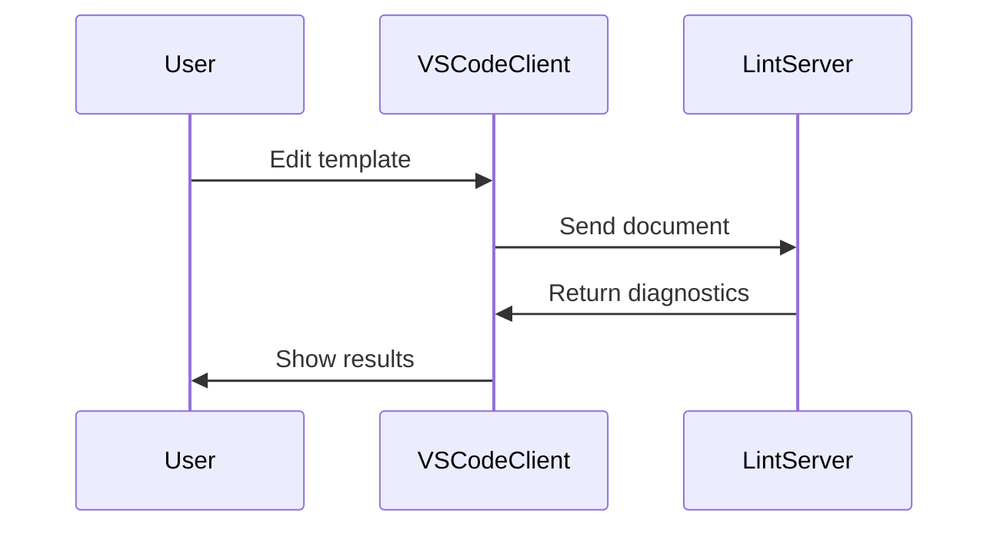

# CFN Lint Visual Studio Code Extension

Welcome to the developer documentation for the CFN Lint Visual Studio Code extension. This guide will help you install, configure, understand, and extend the extension.

## Documentation Index

- [Installation Guide](#installation-guide)
- [Configuration Guide](#configuration-guide)
- [Architecture Overview](#architecture-overview)
- [Data Flow](#data-flow)
- [Extension & Customization Guide](#extension--customization-guide)
- [Troubleshooting](#troubleshooting-guide)
- [Concepts & Dependencies](#concepts--dependencies)

---

## Installation Guide

This guide covers how to install and set up the CFN Lint Visual Studio Code extension for both users and developers.

### Prerequisites

- Visual Studio Code (latest version recommended)
- Node.js (v16+ recommended)
- npm (comes with Node.js)
- Git (for cloning the repository)

### Installing from the Marketplace

1. Open Visual Studio Code.
2. Go to the Extensions view (`Ctrl+Shift+X`).
3. Search for "CFN Lint".
4. Click **Install**.

### Installing for Development

1. Clone the repository:
   ```bash
   git clone https://github.com/aws-cloudformation/cfn-lint-visual-studio-code.git
   cd cfn-lint-visual-studio-code
   ```
2. Install dependencies for both client and server:
   ```bash
   cd client && npm install
   cd ../server && npm install
   ```
3. Build the extension:
   ```bash
   cd ../client
   npm run build
   ```
4. Open the project in VS Code:
   ```bash
   code .
   ```
5. Press `F5` to launch the extension in a new Extension Development Host window.

## Running Tests

- Client tests:
  ```bash
  cd client
  npm test
  ```
- Server tests:
  ```bash
  cd server
  npm test
  ```

## Configuration Guide

Learn how to configure the CFN Lint Visual Studio Code extension to fit your workflow.

### Accessing Extension Settings

1. Open Visual Studio Code.
2. Go to **Settings** (`Ctrl+,`).
3. Search for "CFN Lint" in the search bar.

### Key Configuration Options

- **cfnLint.path**
  Path to the cfn-lint executable. Useful if you have a custom installation.

- **cfnLint.templateGlobPatterns**
  Glob patterns to identify CloudFormation templates in your workspace.

- **cfnLint.additionalArguments**
  Extra command-line arguments passed to cfn-lint.

- **cfnLint.enableDebug**
  Enables debug logging for troubleshooting.

### Example Configuration

```json
{
  "cfnLint.path": "/usr/local/bin/cfn-lint",
  "cfnLint.templateGlobPatterns": ["**/*.yaml", "**/*.json"],
  "cfnLint.additionalArguments": ["--ignore-checks", "E3002"],
  "cfnLint.enableDebug": true
}
```

### Advanced Usage

- You can configure settings at the workspace or user level.
- For large projects, adjust glob patterns to optimize performance.

## Architecture Overview

Understand the structure and design of the CFN Lint Visual Studio Code extension.

### High-Level Structure

The extension follows a **client-server architecture**:

- **Client**: Handles VS Code integration, UI, commands, and communication with the server.
- **Server**: Runs linting logic, processes templates, and returns diagnostics.

### Main Components

- **client/**
  - `src/extension.ts`: Entry point for the VS Code extension.
  - Handles activation, command registration, and communication with the server.
- **server/**
  - Contains linting logic and schema definitions.
  - Communicates with the client via the Language Server Protocol (LSP).
- **schemas/**
  - JSON schemas for CloudFormation resources and validation.

### File Organization

- `client/`: Extension UI and VS Code API usage.
- `server/`: Linting engine and validation logic.
- `docs/`: Developer documentation.
- `images/`: Screenshots and diagrams.
- `resources/`: SVG icons and assets.

### Interaction Flow

1. User opens or edits a CloudFormation template.
2. Client sends the document to the server.
3. Server runs cfn-lint and returns diagnostics.
4. Client displays linting results in the editor.

## Data Flow

This guide explains how data moves through the CFN Lint Visual Studio Code extension.

### Overview

The extension uses the Language Server Protocol (LSP) for communication between the client (VS Code) and the server (linting engine).

### Step-by-Step Data Flow

1. **Template Open/Edit**
   - User opens or edits a CloudFormation template (`.yaml` or `.json`).
2. **Client Request**
   - The client detects the change and sends the document content to the server via LSP.
3. **Server Processing**
   - The server receives the content, runs cfn-lint, and validates against schemas.
4. **Diagnostics Response**
   - The server sends linting results (diagnostics) back to the client.
5. **UI Feedback**
   - The client displays errors, warnings, and suggestions in the editor.

### Error Handling

- If linting fails, the server returns error messages.
- The client displays errors in the "Problems" pane and as inline annotations.

### Example Sequence



## Extension & Customization Guide

Learn how to extend and customize the CFN Lint Visual Studio Code extension.

### Adding New Features

- **Commands**:
  Add new commands in [`client/src/extension.ts`](client/src/extension.ts:1). Register them using VS Code's API.

- **Linting Logic**:
  Modify or extend linting in [`server/src/service/`](server/src/service/). Update handlers or add new validation services.

- **Schemas**:
  Add or update CloudFormation resource schemas in [`server/schema/`](server/schema/).

### Contributing

1. Fork the repository and create a feature branch.
2. Make your changes.
3. Write or update tests in [`client/src/test/`](client/src/test/) and [`server/src/`](server/src/).
4. Submit a pull request with a clear description.

### Best Practices

- Follow the existing code style and linting rules.
- Write unit and integration tests for new features.
- Document your changes in the relevant Markdown files in [`docs/`](docs/).

### Useful References

- [VS Code Extension API](https://code.visualstudio.com/api)
- [Language Server Protocol](https://microsoft.github.io/language-server-protocol/)
- [CloudFormation Linter](https://github.com/aws-cloudformation/cfn-lint)

## Troubleshooting Guide

Find solutions to common problems when developing or using the CFN Lint Visual Studio Code extension.

### Common Issues

#### Extension Not Activating

- Ensure VS Code is updated.
- Check that Node.js and npm are installed.
- Review the extension logs (`Help > Toggle Developer Tools`).

#### Linting Not Working

- Verify cfn-lint is installed and accessible.
- Check the `cfnLint.path` setting in VS Code.
- Ensure your template files match configured glob patterns.

#### Errors in Output Pane

- Open the **Output** pane and select "CFN Lint" from the dropdown.
- Review error messages for clues.
- Enable debug logging with `cfnLint.enableDebug`.

### Debugging Steps

1. Restart VS Code.
2. Reinstall the extension.
3. Run tests in `client/` and `server/` directories.
4. Check for missing dependencies in `package.json`.

### Getting Help

- Review [CONTRIBUTING.md](../CONTRIBUTING.md) for support channels.
- Search for issues or open a new one on [GitHub](https://github.com/aws-cloudformation/cfn-lint-visual-studio-code/issues).

## Concepts & Dependencies

Understand the foundational concepts and dependencies behind the CFN Lint Visual Studio Code extension.

### Key Concepts

#### CloudFormation Templates

- YAML or JSON files defining AWS infrastructure.
- The extension validates these templates for syntax and best practices.

#### Linting

- Automated analysis to catch errors, warnings, and style issues.
- Uses [cfn-lint](https://github.com/aws-cloudformation/cfn-lint) for validation.

#### Schemas

- JSON schemas define valid CloudFormation resources and properties.
- Located in [`server/schema/`](server/schema/).

#### Language Server Protocol (LSP)

- Enables communication between VS Code (client) and the linting engine (server).

### Dependencies

- **cfn-lint**: Core linter for CloudFormation templates.
- **Node.js & npm**: Required for extension development.
- **VS Code Extension API**: Powers integration with the editor.

### Related Files

- [`package.json`](package.json): Lists dependencies for client and server.
- [`server/schema/`](server/schema/): Contains resource schemas.
- [`client/src/extension.ts`](client/src/extension.ts:1): Extension entry point.
